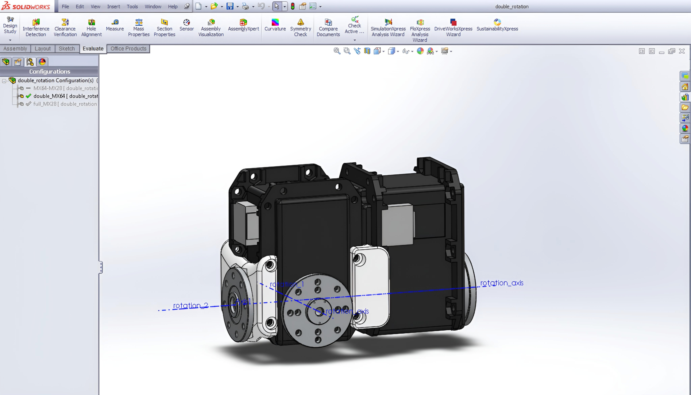
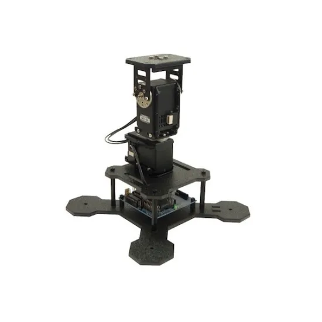
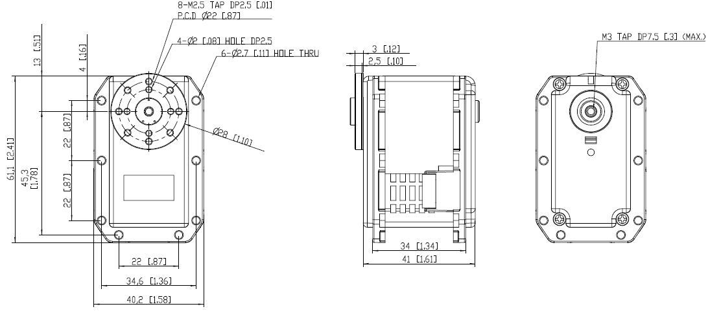

# 🤖 Hybrid Dual‑Rotation Actuator — Concept, Design & CAD

## 📖 Overview
This project presents the **conceptual design** of a **dual‑axis actuator** integrating two Dynamixel MX‑64 servos in a **four‑bearing framework**.  
The design achieves **smooth, precise motion** with enhanced load stability, making it suitable for robotics applications requiring high torque and accuracy.

Key features:
- **Dual‑axis motion** via synchronized Dynamixel MX‑64 servos
- **Four‑bearing support** for load stability and reduced mechanical play
- **Modular 3D‑printed components** for lightweight construction and easy manufacturability
- **Compact, robust design** for integration into robotic arms, gimbals, or pan‑tilt systems

---

## 🛠 Skills & Tools
- **CAD & Simulation:** SOLIDWORKS, mechanical design, assembly modeling
- **Robotics & Mechatronics:** Actuator integration, servo control, motion systems
- **Manufacturing:** 3D printing, modular component design
- **Product Development:** Concept validation, prototyping, research

---

## 📄 Documentation
- [ScorpionX Reference Image](images/scorpionx.jpg)
- [2D Drawing](images/2d_drawing.png)
- [CAD Files & Renders](files/actuator_cad/)

---

## 📸 Gallery
  
*Reference platform for actuator integration.*

  
*Technical drawing of the actuator assembly.*

---

## 🔬 Design Highlights
1. **Dual‑Rotation Mechanism** — Independent yet synchronized control of two rotational axes.
2. **Four‑Bearing Framework** — Enhanced stability under load, reduced wear.
3. **Modular 3D‑Printed Parts** — Lightweight, easy to replace, and cost‑effective.
4. **Servo Integration** — Optimized mounting for Dynamixel MX‑64 servos.

---

## 🚀 Potential Applications
- Robotic arms and manipulators
- Camera gimbals and tracking systems
- Precision positioning platforms
- Research and educational robotics

---

## 📬 Contact
**Md Laisur Rahman Khan Turjo**  
📧 your.email@example.com  
🔗 [LinkedIn](https://linkedin.com/in/yourprofile) | [GitHub](https://github.com/yourusername)
